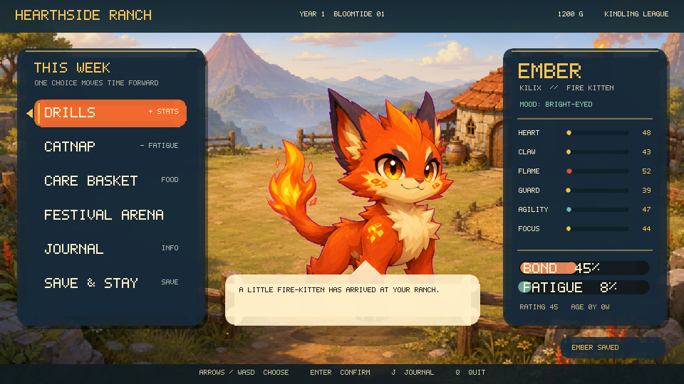
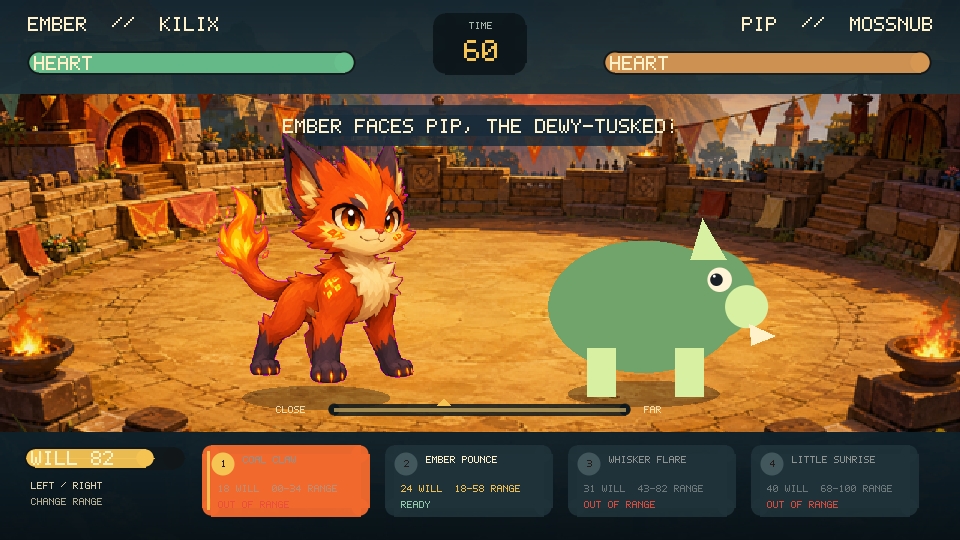

# Kilix Rancher

An original graphical creature-raising game for Linux terminals that implement
the Kitty graphics protocol. Raise a **Kilix**—a tiny fire-kitten with a very
large spark—one week at a time, then take your partner into real-time festival
battles and climb from Kindling League to the Crown.

Kilix Rancher is a native C11 game with a custom software framebuffer. It has
no GUI toolkit or game-engine dependency and displays full-color animation
directly inside Kilix, Kitty, WezTerm, Konsole, or another compatible terminal.





## Features

- One expressive fire-kitten companion with animated idle, tired, happy,
  training, lunge, impact, victory, and defeat states
- 48-week years, four seasons, age, autosaving, money, fatigue, stress, bond,
  form, and six trainable gifts
- Six short drills, weekly catnaps, and four care items
- Six original league rivals with distinct silhouettes and stat profiles
- Real-time arena combat with regenerating Will, manual distance control,
  move ranges, accuracy, evasion, defense, knockouts, and timed decisions
- Responsive 960×540 logical presentation, full-screen illustrated scenes,
  particles, squash-and-stretch motion, flashes, and visual snapshots
- Six cue-specific, no-immediate-repeat sound banks with 23 bundled warm UI,
  training, battle-hit, victory, and setback variations, plus silent fallback
- Deterministic simulation and headless render checks

## Build and play

Requirements are a C11 compiler, `make`, pthreads, zlib development headers,
and a Kitty-graphics terminal.

On Debian or Ubuntu:

```sh
sudo apt install build-essential zlib1g-dev
make
./kilix-rancher
```

Audio is optional. The shared mixer probes `pacat`, `pw-play`, `aplay`, and
SoX `play`; the game remains fully playable without one.

Keyboard input, Kitty presentation, and audio mixing use vendored
`kitty_keyboard`, `kitty-framebuffer`, and `pcm-mixer` sources under
`third_party/`; the illustrated ranch renderer remains game-specific.

## Controls

| Key | Action |
|---|---|
| Arrows / W,S | Move the menu cursor; up/down select a battle move |
| Left / Right | Change range during a live battle (not before it starts) |
| Enter / Space | Choose; call the selected battle move |
| 1–4 | Call a battle move directly |
| Esc | Go back; on the arena Ready prompt it cancels with no penalty, but forfeits a match already in progress |
| J | Open the field journal (from the ranch or champion screen) |
| M | Toggle sound |
| Q | Quit from the title, ranch, or champion screen |

On the ranch and menus, some letters are also direct shortcuts rather than
navigation — for example on the ranch `a` jumps straight into the Arena and `d`
into Drills. Prefer the arrow keys (or `w`/`s`) if you only mean to move the
cursor.

Battle is about timing and position. Will begins partially charged and recovers
in real time. Every move has a different cost and valid range; use left and
right to close or open the distance, then spend Will with `1`–`4`. If the bell
rings before a knockout, the greater remaining Heart percentage wins.

## Raising loop

Each meaningful ranch action advances one week. Drills improve two gifts but
add fatigue and stress. Catnaps recover both. Care costs money but can improve
bond, form, or recovery. Arena wins are the main source of money and unlock the
next league. Kilix visibly reacts to poor condition, so the UI never requires
hidden-number memorization.

The six gifts are Heart, Claw, Flame, Guard, Agility, and Focus. They map to
health, physical force, special force, damage reduction, evasion/range motion,
and accuracy.

## Verification

```sh
make validate-assets
make test
./kilix-rancher --selftest 1337 480
./kilix-rancher --render-test .render-test 1337
```

`make test` runs two deterministic long simulations, validates every runtime
image and WAV, renders twelve gameplay states headlessly, and verifies that
every snapshot exists.

Useful overrides:

```sh
KILIX_RANCHER_ASSETS=/path/to/assets ./kilix-rancher
KILIX_RANCHER_SAVE=/path/to/save.dat ./kilix-rancher
KILIX_RANCHER_SKIP_PROBE=1 ./kilix-rancher
```

## Originality and provenance

This is an original game inspired by the decision rhythm of 1990s
creature-raising simulations. It does not ship characters, monsters, art,
audio, text, data, or interface assets from *Monster Rancher* or another game.

See [asset sources](docs/asset-sources.md) for the exact art prompts, processing
pipeline, audio generation and mastering record, and code provenance.

The code and project-specific visual assets are MIT licensed to the extent
applicable. The ElevenLabs-generated WAVs have a separate bundled-game asset
exception and are not standalone MIT samples. The terminal transport is
adapted from the MIT-licensed `chess-bash` architecture.
